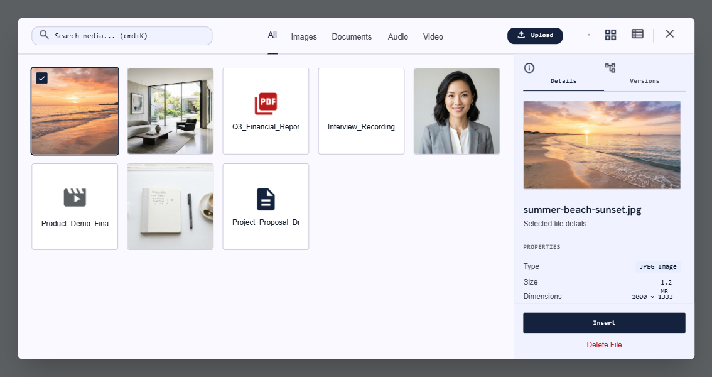

# Media Library Picker

Media Library Picker is a modern, lightweight file management interface built with vanilla JavaScript principles in mind. No frameworks, no build step required to use it.



The plugin consists of:

- `src/media-library.css` — stylesheet
- `src/media-library-core.js` — headless core (state, API calls, uploads, events)
- `src/media-library-picker.js` — the popup media picker UI, built on top of the core
- `dist/media-library.min.js` — core + picker, combined and minified for production use
- `dist/media-library.min.css` — minified stylesheet

## Quick start

```html
<link rel="stylesheet" href="dist/media-library.min.css" />
<script src="dist/media-library.min.js"></script>

<button id="open-picker">Open Media Library</button>

<script>
	const picker = new MediaLibraryPicker({
		multiple: false,
		filters: ['image', 'document', 'audio', 'video'],
		triggers: ['#open-picker'],
		endpoints: {
			list: '/api/media', // GET  ?filter=&search=&pageSize= -> { items } or [ items ]
			upload: '/api/media/upload', // POST multipart/form-data, field "file" -> item
			delete: '/api/media/:id', // DELETE -> 2xx
			detail: '/api/media/:id', // GET -> item (optional, used for versions)
		},
		callbacks: {
			onOpen() {},
			onClose() {},
			onSelect(items) {},
			onInsert(item) {}, // fired on "Insert" click, then the picker closes
			onDelete(item) {},
			onUploadComplete(record) {},
			onUploadError(record) {},
		},
	});

	// also callable programmatically:
	// picker.open();
	// picker.close();
</script>
```

With no `endpoints.list` configured, the widget runs against a small built-in demo dataset so it's explorable immediately — see `demo/index.html`.

## Configuration

| Option | Type | Description |
| --- | --- | --- |
| `endpoints.list` | `string` | GET endpoint returning files. Accepts `filter`, `search`, `pageSize` query params. |
| `endpoints.upload` | `string` | POST endpoint accepting `multipart/form-data` (field `file`). Upload progress is tracked via `XMLHttpRequest`. |
| `endpoints.delete` | `string` | DELETE endpoint, `:id` is replaced with the file id. |
| `endpoints.detail` | `string` | GET endpoint for a single file's detail/versions, `:id` is replaced with the file id. |
| `filters` | `string[]` | Which category tabs to show, any of `image`, `document`, `audio`, `video`. |
| `multiple` | `boolean` | Allow multi-select (cmd/ctrl+click) and multi-file upload. |
| `accept` | `string` | Passed to the native file input's `accept` attribute. |
| `headers` | `object` | Extra headers sent with every request (e.g. an auth token). |
| `withCredentials` | `boolean` | Send cookies with requests. |
| `triggers` | `(string\|Element)[]` | Selectors or elements that open the picker on click. |
| `callbacks` | `object` | See above — `onOpen`, `onClose`, `onSelect`, `onInsert`, `onDelete`, `onUploadComplete`, `onUploadError`. |

Files can also be dropped directly onto the picker window to upload them.

## Development

```sh
npm install
npm run build   # regenerates dist/media-library.min.js and dist/media-library.min.css
```

Open `demo/index.html` (via a static file server, e.g. `npx http-server .`) to try the picker against the built-in demo dataset.
